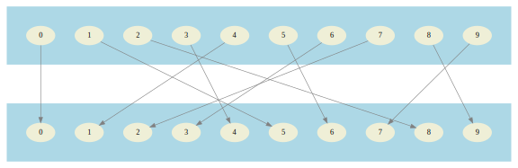

# cryptic-sequences

## What

"cryptic-sequences" is a library that allows one to generate a pseudo-random numbers generator (PRNG) that
return numbers that are guaranteed to be unique. They are part of a growing family of so-called *splittable*
pseudo-random number generators (PRNG). Links to relevant papers are provided at the end of the document.

*cryptic-sequences* sacrifices speed for flexibility and simplicity. It can generate PRNGs that have periods
covering all the *words* that can be generated with *n* digits of a given base. Despite its simplicity,
the result of *cryptic-sequences* pass most statistical tests for randomness.

## Why

Being able to generate unique pseudo-random numbers is useful, for example, to generate unique identifiers
that are visible to the user, but that leak no obvious information about the number of identifiers that have
been generated so far, whether a given identifier has been generated before another one, etc.

## How

### Usage

There is a command-line interface that can be used.

```
> java -jar cryptic-sequences-2.2.4-all.jar --help
Usage: cryptic-sequences-cli options_list
Options:
--base [10] -> The base to use for generated values. { Int }
--size [3] -> The number of digits each generated value should have. { Int }
--key [] -> The 48 bits key to use to encrypt the sequence, in base 64 (up to 6 digits). { String }
--start [0] -> The index from which to start in the sequence. { Int }
--strength [10] -> Controls the number of time the encryption algorithm is applied. { Int }
--count -> The number of generated values. { Int }
--byte-count -> Output values in binary mode, using "x" bytes for each number, truncating them if necessary. { Int }
--block-size [1024] -> Block size in values (not in bytes). When option "byte-count" is present and output is binary,
this option allows to speed-up output by writing multiple values at a time. { Int }
--output, -o -> File where to write the data. The standard input is used otherwise. { String }
--help, -h -> Usage info
```

Let's say you want to generate five unique numbers having eight decimal digits each. You do:

```
> java -jar cryptic-sequences-cli-2.2.4-all.jar --size 8 --count 5
08118345
65626778
53413275
92771198
05179246
```
To generate the next numbers, you have to provide the starting point. Let's start at three, to show the overlap.
```
> java -jar cryptic-sequences-cli-2.2.4-all.jar --size 8 --count 7 --start 3
92771198
05179246
16103705
10269111
26670265
28208848
31639447
```
To generate different sequences of number, you can use a different key. key "AAAAAA" (0 in base64) is the default,
by the way. Also, if you do not provide the full six digits of the key, it will be padded with 'A's to the right.
(the least significant digits are on the left).
```
> java -jar cryptic-sequences-cli-2.2.4-all.jar --size 8 --count 5 --key HeJWHF
30932557
84782757
53834633
04435028
73866892
```

To have a demonstration that all numbers are generated once and only once, one can
count the lines, and check that the number of lines stays the same when duplicates
are removed.
```
> java -jar cryptic-sequences-cli-2.2.4-all.jar --size 4 | wc -l
10000

> java -jar cryptic-sequences-cli-2.2.4-all.jar --size 4 | sort | uniq | wc -l
10000
```


## No, seriously, how ?

Generating pseudo-random unique numbers is one of those problems that appear extremely simple once you grasp the
required mathematical insights, but that is still kind of hard to do in practice.

### Encryption 101

The recipe is simple: use a sequence of numbers (0, 1, 2, 3, ...) and encrypt it in some way.
By design, an encryption algorithm (aka a cypher) generates values that appear to be random. Also, by definition
it is reversible; it is a [bijection](https://en.wikipedia.org/wiki/Bijection). The
generated numbers are thus guaranteed to be unique. Note that the reversibility requirement is what separates an
encryption algorithm from a hash.

#### Proof
If the generated numbers where not unique, it would mean that multiple source texts could be mapped to
the same encrypted text, making the operation irreversible, and thus not an encryption.


### Practical considerations

In practice, one would want to use a
[symmetric key algorithm](https://en.wikipedia.org/wiki/Symmetric-key_algorithm),
both for simplicity, performance, and because a
[public key algorithm](https://en.wikipedia.org/wiki/Public-key_cryptography) has no benefit for our use case.

Also, it is important to select a block cypher that has a block size equal to the size of the identifiers we want to
generate. A stream cypher like RC4 can also be used for identifiers that have a size that is an exact number of
bytes (so not for *weird* number bases like 10).
This is **the problem** that *cryptic-sequences* solves, the inability to have a block size of an arbitrary length. However,
first, lets look at examples that use well known cyphers.

### Let's do it using DES

The problem with well established, modern encryption algorithm, is that their block size is quite large. So, that's
why we are looking at DES, an outdated encryption algorithm that is perfectly fine for this example. It has a
relatively small block size of *only* 64 bits. So we'll generate 64 bits identifiers.

```
> echo -n 0 | openssl des-ecb -e -K 1122334455667788 | xxd -p
67053908c77c76dc

> echo -n 1 | openssl des-ecb -e -K 1122334455667788 | xxd -p
56f557c71903753f

> echo -n 2 | openssl des-ecb -e -K 1122334455667788 | xxd -p
4fdb1007fc4abc77
```
You get the idea. What if you want a shorter identifier ? Well, you are out of luck with DES because if one shortens
the output in any way, one looses the reversibility and thus the uniqueness of the generated numbers. Another
cypher with a smaller block size has to be used. What about RC4, being a stream cypher, it has a "block size" of
only one byte ?

```
> echo -n 0 | openssl rc4-40 -e -K 1122334455 | xxd -p
da

> echo -n 1 | openssl rc4-40 -e -K 1122334455 | xxd -p
db

> echo -n 2 | openssl rc4-40 -e -K 1122334455 | xxd -p
d8

> echo -n 3 | openssl rc4-40 -e -K 1122334455 | xxd -p
d9
```
Ewww ! maybe not RC4. To be fair, I didn't do any research on how to circumvent its weaknesses. Anyway, you get the
idea: there is room for improvement.

### Let's cook a new encryption algorithm

Well, we need to come up with a bijection that maps a set of numbers to elements of the same set, in the most
unpredictable way. Why not shuffle an array using a well known shuffling algorithm such as the
[Fisher–Yates shuffle](https://en.wikipedia.org/wiki/Fisher%E2%80%93Yates_shuffle) and some pseudo-random generator ?
There are many advantages to this technique:
- A cipher can be generated for a set of any size.
- It allows to leverage an existing pseudo-random generator; the hard work is already done.
- The key to our cypher is the seed provided to the pseudo-random number generator.
- It is very fast once the table is generated.

There is obviously one major drawback:
- The table to store, or regenerate, can get impracticably large for large block sizes.

#### What can be done from there

One thing that can be done is to take a table of a reasonable size and apply it multiple times,
at different locations on the word, in order to quickly "shuffle" it to a new unpredictable value.
 
Let's say we take an array of the digits 0 to 99, and we shuffle it. Then we fill a 10x10 table
with the resulting values.

<small>

|     |   0  |   1  |   2  |   3  |   4  |   5  |   6  |   7  |   8  |   9  |
|:---:|:----:|:-----|:----:|:----:|:----:|:----:|:----:|:----:|:----:|-----:|
|**0**|  24  |  54  |  94  |  80  |  47  |  40  |  63  |  97  |  42  |  96  |
|**1**|  99  |  44  |  43  |  22  |  69  |  79  |  34  |  41  |  85  |  37  |
|**2**|  89  |  93  |  15  |  17  |  62  |  76  |  02  |  45  |  67  |  08  |
|**3**|  18  |  58  |  71  |  29  |  46  |  78  |  11  |  07  |  04  |  27  |
|**4**|  68  |  09  |  81  |  95  |  70  |  75  |  39  |  72  |  13  |  19  |
|**5**|  55  |  83  |  64  |  28  |  86  |  06  |  05  |  31  |  14  |  20  |
|**6**|  30  |  00  |  65  |  82  |  32  |  56  |  91  |  98  |  88  |  35  |
|**7**|  90  |  92  |  66  |  49  |  10  |  48  |  53  |  74  |  12  |  23  |
|**8**|  38  |  21  |  26  |  52  |  84  |  03  |  01  |  57  |  50  |  77  |
|**9**|  16  |  51  |  36  |  73  |  33  |  59  |  87  |  25  |  61  |  60  |

</small>

Now, let's use that table to encrypt the value 0000
```
▼  ▼
0  0  0  0    t[0][0] = 24

   ▼  ▼
2  4  0  0    t[4][0] = 68

      ▼  ▼
2  6  8  0    t[8][0] = 38

2  6  3  8
```
A substitution sets one digit of the result, and the second digit influences
the next substitution. Substitution are compounded and that's what makes the
last digits of the word taking values that appear so random. 

**Note on reversibility:**
Since all substitutions are reversible operations, the operation as
a whole is also reversible. Of course, the table, as it is, makes it somewhat
hard since one has to find a two digits number in one of its cell, and it can
be any one of them. In practice, an inverse table is used to perform the decryption.

#### Refining the algorithm

The encryption above looks pretty good, but not so much if we pay closer
attention. Last digits are shuffled pretty well, but the first ones, not
so much. All words that start with *00* will always end-up being encrypted
to a word starting with *2*. That's not acceptable.

The way to fix this is to do multiple passes. Also, we will rotate the whole
word to the left, so that the least shuffled digit will be the best shuffled
one on the next pass.

There is one problem left. What if we end-up with a table that maps *00* to
itself. This will happen, on average, one time over one hundred generated
keys. So, *0000* will be mapped to itself way too often. One way to solve the
problem is to add one to each digit after each pass. That way, we will be able
to free ourselves from this kind of situation.

Let continue our encryption...

```
2  6  3  8    rotate to the left

6  3  8  2    add one to each digit

▼  ▼
7  4  9  3    t[7][4] = 10

   ▼  ▼
1  0  9  3    t[0][9] = 96  

      ▼  ▼
1  9  6  3    t[6][3] = 82 

1  9  8  2    rotate to the left (end of second pass)

9  8  2  1    add one to each digit (end of second pass)

0  9  3  2    that's the result at the end of the second pass
```

Now, how many passes should be done to have something that appears truly random ?
It depends on the size of the table used to shuffle the digits. For small base
systems, tables having additional dimensions are used, so that the table size
is of at least 100 elements. In practices, using hexadecimal digits, 10 passes
is enough to pass all the *dieharder* randomness tests.

*Dieharder* is a program that allows one to evaluate the quality of a random number
generator using a suite of statistical tests. Those test include the famous
*Diehard* tests.

```
java -jar cryptic-sequences-cli-2.2.4-SNAPSHOT-all.jar \
    --size 14 \
    --base 16 \
    --byte-count 7 \
    --strength 10 \
    | dieharder -g 200 -a
#=============================================================================#
#            dieharder version 3.31.1 Copyright 2003 Robert G. Brown          #
#=============================================================================#
   rng_name    |rands/second|   Seed   |
stdin_input_raw|  6.04e+05  | 758773010|
#=============================================================================#
        test_name   |ntup| tsamples |psamples|  p-value |Assessment
#=============================================================================#
   diehard_birthdays|   0|       100|     100|0.83887091|  PASSED  
      diehard_operm5|   0|   1000000|     100|0.41998090|  PASSED  
  diehard_rank_32x32|   0|     40000|     100|0.50543698|  PASSED  
    diehard_rank_6x8|   0|    100000|     100|0.14972002|  PASSED  
   diehard_bitstream|   0|   2097152|     100|0.49392852|  PASSED  
        diehard_opso|   0|   2097152|     100|0.94876854|  PASSED  
        diehard_oqso|   0|   2097152|     100|0.58282417|  PASSED  
         diehard_dna|   0|   2097152|     100|0.02428606|  PASSED  
diehard_count_1s_str|   0|    256000|     100|0.89654765|  PASSED  
diehard_count_1s_byt|   0|    256000|     100|0.49960447|  PASSED  
 diehard_parking_lot|   0|     12000|     100|0.77743129|  PASSED  
    diehard_2dsphere|   2|      8000|     100|0.90089711|  PASSED  
    diehard_3dsphere|   3|      4000|     100|0.93344892|  PASSED  
     diehard_squeeze|   0|    100000|     100|0.34453380|  PASSED  
        diehard_sums|   0|       100|     100|0.00013626|   WEAK   
        diehard_runs|   0|    100000|     100|0.42278127|  PASSED  
        diehard_runs|   0|    100000|     100|0.87179635|  PASSED  
       diehard_craps|   0|    200000|     100|0.77027333|  PASSED  
       diehard_craps|   0|    200000|     100|0.65596374|  PASSED  
 marsaglia_tsang_gcd|   0|  10000000|     100|0.92963739|  PASSED  
 marsaglia_tsang_gcd|   0|  10000000|     100|0.20769738|  PASSED  
         sts_monobit|   1|    100000|     100|0.68066763|  PASSED  
            sts_runs|   2|    100000|     100|0.47059752|  PASSED  
          sts_serial|   1|    100000|     100|0.03139430|  PASSED  
          sts_serial|   2|    100000|     100|0.51408161|  PASSED  
          sts_serial|   3|    100000|     100|0.28793344|  PASSED  
          sts_serial|   3|    100000|     100|0.14496027|  PASSED  
          sts_serial|   4|    100000|     100|0.07472481|  PASSED  
          sts_serial|   4|    100000|     100|0.29400779|  PASSED  
          sts_serial|   5|    100000|     100|0.09529000|  PASSED  
          sts_serial|   5|    100000|     100|0.95421449|  PASSED  
          sts_serial|   6|    100000|     100|0.79498286|  PASSED  
          sts_serial|   6|    100000|     100|0.46229277|  PASSED  
          sts_serial|   7|    100000|     100|0.46110124|  PASSED  
          sts_serial|   7|    100000|     100|0.69354046|  PASSED  
          sts_serial|   8|    100000|     100|0.92231105|  PASSED  
          sts_serial|   8|    100000|     100|0.93172700|  PASSED  
          sts_serial|   9|    100000|     100|0.64887948|  PASSED  
          sts_serial|   9|    100000|     100|0.98643204|  PASSED  
          sts_serial|  10|    100000|     100|0.75701293|  PASSED  
          sts_serial|  10|    100000|     100|0.93236462|  PASSED  
          sts_serial|  11|    100000|     100|0.84614275|  PASSED  
          sts_serial|  11|    100000|     100|0.73211556|  PASSED  
          sts_serial|  12|    100000|     100|0.59264112|  PASSED  
          sts_serial|  12|    100000|     100|0.17687590|  PASSED  
          sts_serial|  13|    100000|     100|0.13302742|  PASSED  
          sts_serial|  13|    100000|     100|0.81643231|  PASSED  
          sts_serial|  14|    100000|     100|0.06128837|  PASSED  
          sts_serial|  14|    100000|     100|0.10401939|  PASSED  
          sts_serial|  15|    100000|     100|0.07130613|  PASSED  
          sts_serial|  15|    100000|     100|0.48054138|  PASSED  
          sts_serial|  16|    100000|     100|0.02402599|  PASSED  
          sts_serial|  16|    100000|     100|0.26806753|  PASSED  
         rgb_bitdist|   1|    100000|     100|0.52044211|  PASSED  
         rgb_bitdist|   2|    100000|     100|0.06856119|  PASSED  
         rgb_bitdist|   3|    100000|     100|0.69543543|  PASSED  
         rgb_bitdist|   4|    100000|     100|0.62598637|  PASSED  
         rgb_bitdist|   5|    100000|     100|0.95080167|  PASSED  
         rgb_bitdist|   6|    100000|     100|0.53256626|  PASSED  
         rgb_bitdist|   7|    100000|     100|0.80515870|  PASSED  
         rgb_bitdist|   8|    100000|     100|0.75402651|  PASSED  
         rgb_bitdist|   9|    100000|     100|0.09290876|  PASSED  
         rgb_bitdist|  10|    100000|     100|0.79745718|  PASSED  
         rgb_bitdist|  11|    100000|     100|0.87692790|  PASSED  
         rgb_bitdist|  12|    100000|     100|0.05472123|  PASSED  
rgb_minimum_distance|   2|     10000|    1000|0.13133000|  PASSED  
rgb_minimum_distance|   3|     10000|    1000|0.20428047|  PASSED  
rgb_minimum_distance|   4|     10000|    1000|0.43411254|  PASSED  
rgb_minimum_distance|   5|     10000|    1000|0.76007967|  PASSED  
    rgb_permutations|   2|    100000|     100|0.98412353|  PASSED  
    rgb_permutations|   3|    100000|     100|0.65979972|  PASSED  
    rgb_permutations|   4|    100000|     100|0.66638295|  PASSED  
    rgb_permutations|   5|    100000|     100|0.67378511|  PASSED  
      rgb_lagged_sum|   0|   1000000|     100|0.11786915|  PASSED  
      rgb_lagged_sum|   1|   1000000|     100|0.60681449|  PASSED  
      rgb_lagged_sum|   2|   1000000|     100|0.07222434|  PASSED  
      rgb_lagged_sum|   3|   1000000|     100|0.60454073|  PASSED  
      rgb_lagged_sum|   4|   1000000|     100|0.06910332|  PASSED  
      rgb_lagged_sum|   5|   1000000|     100|0.36021681|  PASSED  
      rgb_lagged_sum|   6|   1000000|     100|0.15993040|  PASSED  
      rgb_lagged_sum|   7|   1000000|     100|0.10521590|  PASSED  
      rgb_lagged_sum|   8|   1000000|     100|0.99510229|   WEAK   
      rgb_lagged_sum|   9|   1000000|     100|0.73139716|  PASSED  
```

Of course, it is not a good idea to use *cryptic-sequences* as a pseudo-random number
generator since it is around two orders of magnitude slower that a typical one.

## Other resources

### Other pseudo-random number generators that generate unique results

There are a number of other pseudo-random number generators out there that produce
unique numbers, sometimes as an undesired side effect. They are much faster algorithms
than what was exposed here. However, they do not offer the same flexibility.

#### SplittableRandom
SplittableRandom is a random number generator that has been introduced with Java 8. It has been
modified **not** to produce unique numbers, but in its original form, it did. It is an improvement
over an algorithm called *DotMix*. <br/>
[SplittableRandom paper](https://www.researchgate.net/publication/273188325_Fast_Splittable_Pseudorandom_Number_Generators)

#### SplitMix
SplitMix is a new random number generator for Haskell. It is an other algorithm derived from *DotMix*. <br/>
[SplitMix paper](https://www.researchgate.net/publication/273188325_Fast_Splittable_Pseudorandom_Number_Generators)
<br/>
[SplitMix blog post](https://www.tweag.io/blog/2020-06-29-prng-test/)

#### DotMix
The original algorithm that inspired many others. <br/>
[DotMix paper](https://www.researchgate.net/publication/221643681_Deterministic_Parallel_Random-Number_Generation_for_Dynamic-Multithreading_Platforms)

### Statistical tests

#### Dieharder
One of the most well known suite of statistical tests. Possibly a bit dated.
<br/>
[Dieharder project page](https://webhome.phy.duke.edu/~rgb/General/dieharder.php)

#### TestU01
From *l'Université de Montréal*. I studied some mathematics there, before going back to software
engineering. <br/>
[TestU01 project page](http://simul.iro.umontreal.ca/testu01/tu01.html)
<br/>
[TestU01 paper](https://www.researchgate.net/publication/278718594_TestU01)

Note: I have not tried it yet.

#### PracRand
"PractRand (Practically Random) is a C++ library of pseudo-random number
generators (PRNGs, or just RNGs) and statistical tests for RNGs." <br/>
[PracRand project page](https://sourceforge.net/projects/pracrand/)

Note: I have not tried it yet.
